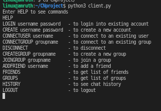

# CNproject
A simple CLI chat server using socket programming and multithreading in python.
This applications allows clients in the same network to chat with other client or a group of clients together. 
It has sockets at server and client side which are used for sending messages.

## Features
* Group chatting is included
* Chat history will be saved

## How it works
There is a server socket which keeps on listeing to a specific port. Client server will be connected to that port. 
Once the connection is succesful client can REGISTER/LOGIN to start chatting.
Multithreading at server side is used to handle multiple clients. At client side it is used for sending and receving messages.  
Initially client has to create a unique username for the first time. 
Later he can use it whenever he wants to chat. If two clients wants to communicate they have to be connected to each other. MongoDB is used for storing the chat history.
All these actions can be perfomed using some specific messages.

  
clickhere.png

  
   
   

